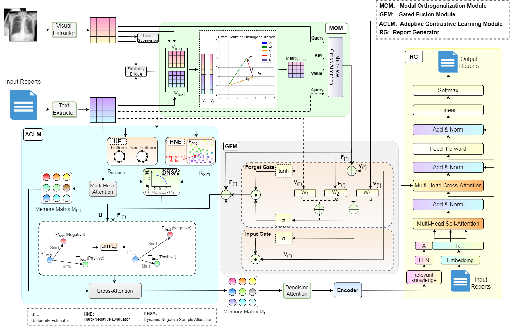

# Cross-Modal Orthogonal Adaptive Contrastive Learning for Robust Chest Radiology Report Generation(COACL)


## Overview

Chest radiology report generation plays a crucial role in clinical decision-making by reducing radiologists’ workload and minimizing missed diagnoses. However, current models struggle with cross-modal semantic alignment due to feature heterogeneity between images and texts and suboptimal negative sample selection strategies.

We present COACL, a cross-modal orthogonal adaptive contrastive learning framework designed to enhance image-text alignment and improve report generation. COACL integrates three key components: (1) a Modal Orthogonality Module (MOM) that leverages Schmidt orthogonalization to decouple modality-specific features, (2) a Guided Fusion Module (GFM) with a dual-stream gated structure to emphasize semantic complementarity, and (3) an Adaptive Contrastive Learning Module (ACLM) that dynamically adjusts negative sample difficulty based on semantic similarity.

Experiments on IU-Xray and MIMIC-CXR demonstrate that COACL achieves superior performance over existing baselines. The source code is available at https://github.com/cloneiq/COACL.

<div  align="center">    

</div>

This paper has been submitted to **Knowledge-Based Systems** .

## Requirements
- Python 3.8  
- PyTorch 1.11.0  
- CUDA 11.3  

## Project Structure
```bash
├── checkpoints
├── data
│   ├── mimic-cxr
│   │   ├──images
│   │   ├──train.json
│   │   ├──valid.json
│   │   ├──test.json
│   ├── iu-xray
│   │   ├──images
│   │   ├──annotation.json
├── trainer
```
## Data Preparation

### Datasets

1. Download the datasets.
   1. IU-Xray: A widely used chest X-ray dataset consisting of 7,470 frontal X-ray images and corresponding radiology reports. It is commonly used for medical report generation tasks.
      • Images: https://openi.nlm.nih.gov/imgs/collections/NLMCXR_png.tgz
      • Reports: https://openi.nlm.nih.gov/imgs/collections/NLMCXR_reports.tgz
   2. MIMIC-CXR: A large-scale publicly available chest radiograph dataset containing over 370,000 images and corresponding free-text radiology reports. It was collected from the Beth Israel Deaconess Medical Center between 2011 and 2016.
      • Download: https://physionet.org/content/mimic-cxr/2.1.0/
      Note: Access requires a PhysioNet account and credentialed data use agreement approval.
2. Place the files under the `data/` directory.

## Train & Test

```bash
# cd this file 
python trainer.py
```

## Features

- Cross-modal contrastive learning framework to enhance image-text semantic alignment for chest radiology report generation

- Modal Orthogonality Module (MOM) to decouple image and text features into orthogonal subspaces using Schmidt orthogonalization

- Guided Fusion Module (GFM) with a dual-stream gated architecture to dynamically highlight salient semantic regions and improve modality complementarity

- Adaptive Contrastive Learning Module (ACLM) that adjusts negative sample hardness based on semantic similarity and feature uniformity to sharpen decision boundaries

- Proven effectiveness over state-of-the-art baselines on both IU-Xray and MIMIC-CXR datasets
  
- Modular, extensible PyTorch implementation with reproducible training pipelines

## Result
 Model Performance Comparison on IU-Xray and MIMIC-CXR
| Dataset | Year | Model      | BLEU-1    | BLEU-2    | BLEU-3    | BLEU-4    | CIDEr     | ROUGE-L   |
| ------- | ---- | ---------- | --------- | --------- | --------- | --------- | --------- | --------- |
| IU-Xray | 2021 | PPKED      | 0.480     | 0.309     | 0.224     | 0.168     | 0.183     | 0.376     |
|         | 2021 | AlignTrans | 0.484     | 0.313     | 0.225     | 0.173     | –         | 0.379     |
|         | 2022 | Prior SA   | 0.482     | 0.313     | 0.232     | 0.181     | –         | 0.381     |
|         | 2022 | KdTNet     | 0.474     | 0.316     | 0.225     | 0.169     | 0.341     | 0.375     |
|         | 2023 | RAMT       | 0.482     | 0.310     | 0.221     | 0.165     | –         | 0.377     |
|         | 2023 | MMTN       | 0.486     | 0.321     | 0.232     | 0.175     | 0.361     | 0.375     |
|         | 2023 | KEG        | 0.497     | 0.319     | 0.230     | 0.174     | 0.407     | **0.399** |
|         | 2023 | VKFMFMD    | 0.494     | 0.325     | 0.233     | 0.179     | –         | 0.390     |
|         | 2024 | ASGMDN     | 0.489     | 0.326     | 0.232     | 0.173     | –         | 0.397     |
|         | 2024 | SSVE       | 0.492     | 0.321     | 0.233     | 0.180     | –         | 0.379     |
|         | 2025 | STD        | 0.503     | 0.326     | 0.236     | 0.180     | 0.401     | 0.392     |
|         | 2025 | LACCOL     | 0.508     | 0.321     | 0.229     | 0.172     | –         | 0.392     |
|         |      | **Ours**   | **0.517** | **0.346** | **0.253** | **0.189** | **0.422** | 0.385     |

| Dataset   | Year | Model         | BLEU-1    | BLEU-2    | BLEU-3    | BLEU-4    | CIDEr     | ROUGE-L   |
| --------- | ---- | ------------- | --------- | --------- | --------- | --------- | --------- | --------- |
| MIMIC-CXR | 2021 | PPKED         | 0.360     | 0.224     | 0.149     | 0.106     | 0.237     | 0.284     |
|           | 2021 | AlignTrans    | 0.378     | 0.235     | 0.156     | 0.112     | –         | 0.283     |
|           | 2022 | Prior SA      | 0.356     | 0.222     | 0.151     | 0.111     | 0.154     | 0.280     |
|           | 2022 | MSAT          | 0.373     | 0.235     | 0.162     | **0.120** | –         | 0.282     |
|           | 2022 | Multicriteria | 0.351     | 0.223     | 0.157     | 0.118     | **0.281** | 0.287     |
|           | 2023 | RAMT          | 0.362     | 0.229     | 0.157     | 0.113     | –         | 0.284     |
|           | 2023 | MMTN          | 0.379     | 0.238     | 0.159     | 0.116     | –         | 0.283     |
|           | 2023 | KEG           | 0.386     | 0.233     | 0.157     | 0.111     | 0.111     | 0.274     |
|           | 2024 | ASGMDN        | 0.372     | 0.233     | 0.154     | 0.112     | –         | 0.286     |
|           | 2024 | SSVE          | 0.373     | 0.230     | 0.161     | 0.112     | –         | 0.297     |
|           | 2025 | STD           | 0.384     | 0.235     | 0.156     | 0.111     | 0.137     | 0.273     |
|           | 2025 | LACCOL        | 0.381     | 0.230     | 0.155     | 0.112     | –         | 0.292     |
|           |      | **Ours**      | **0.394** | **0.246** | **0.164** | 0.116     | 0.106     | **0.300** |

## Future Work

- Integration of medical terminology ontology for improved domain accuracy
- Modeling inter-concept relationships to enhance consistency in terminology generation

## Contributing

We welcome pull requests and issues!

## License

This project is licensed under the MIT License. See the [LICENSE](https://opensource.org/license/MIT) file for details.

## Contact

**First Author**: Qian Tang, Kunming University of Science and Technology Kunming, Yunnan CHINA, email: 775791286@qq.com

**Corresponding Author**: Lijun Liu, Ph.D., Kunming University of Science and Technology Kunming, Yunnan CHINA, email: cloneiq@kust.edu.cn

